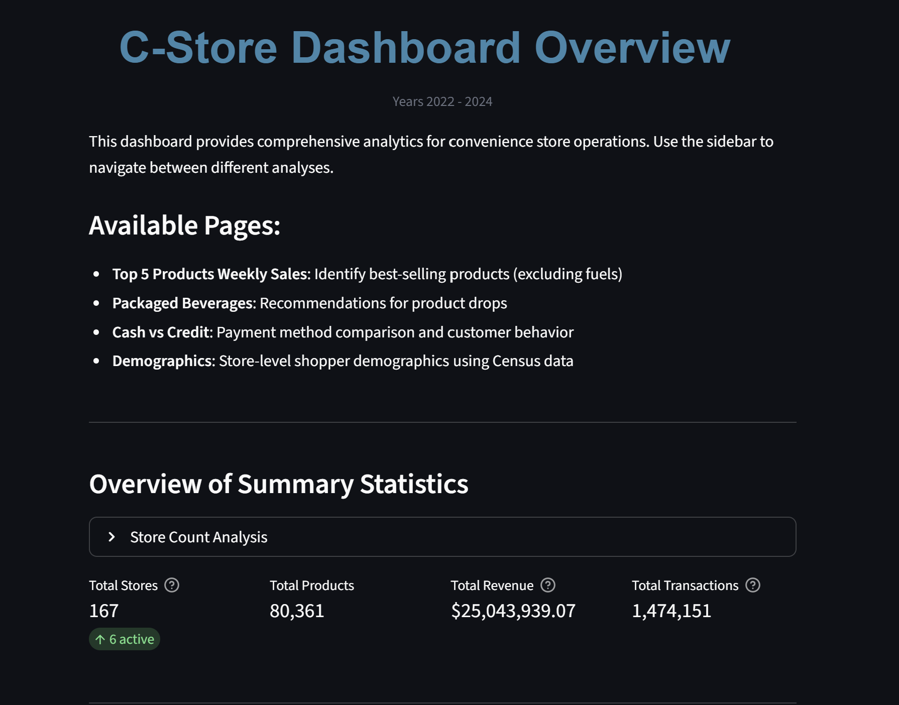
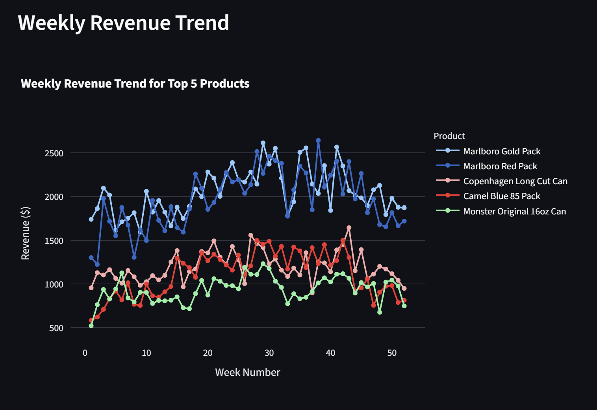
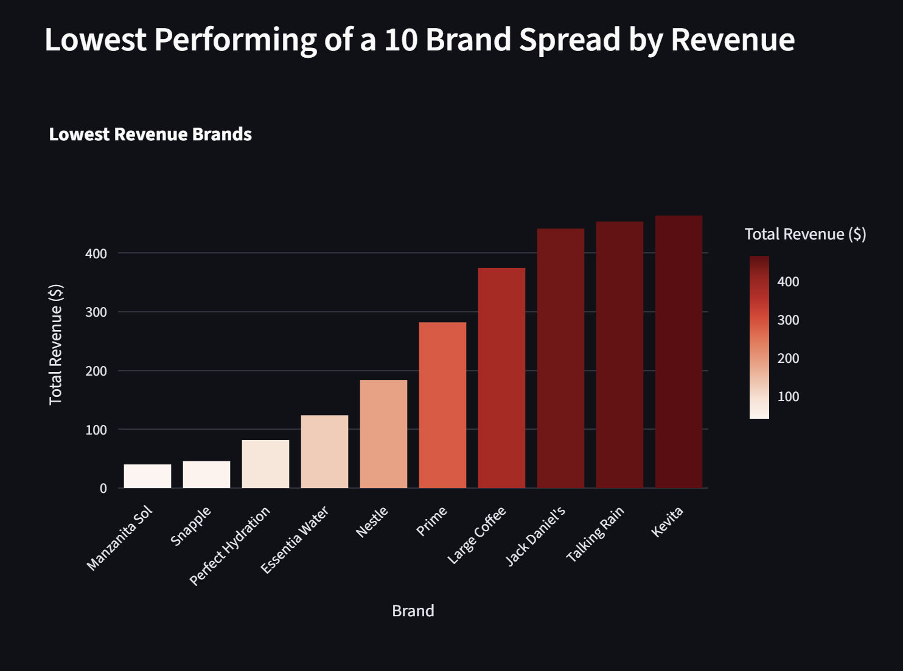
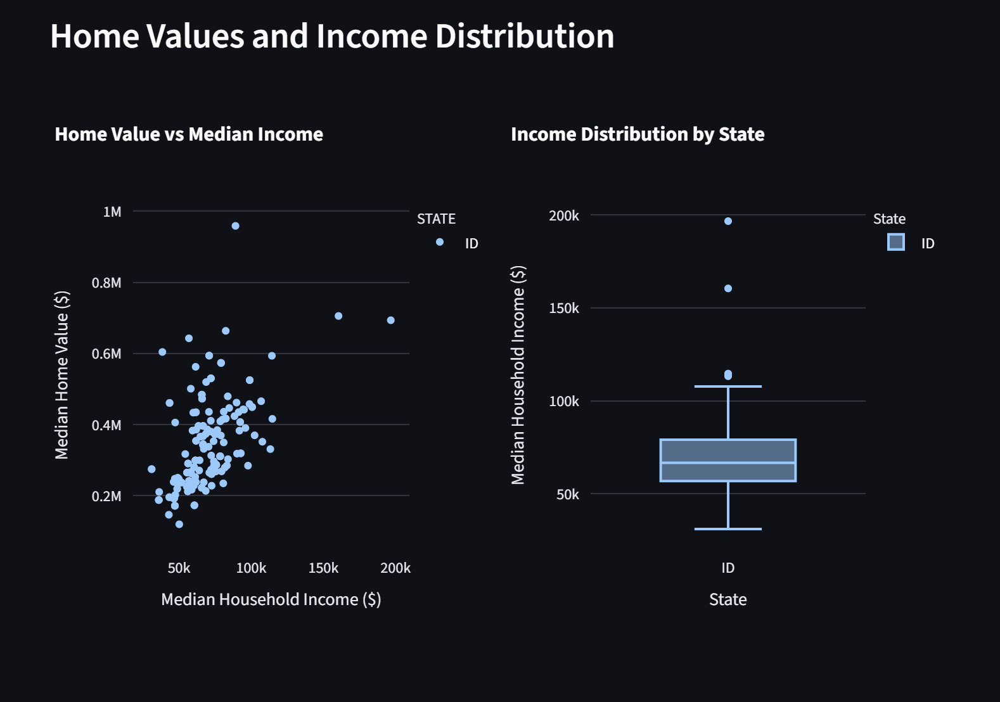

# Field Study of Convenience Store Data - Idaho 

NOTE: Large Scale Data Analysis, with a focus on data visualization and dashboard creation, using real-world convenience store data from Idaho; contains several million rows of convenience store transactions, which was designed as a way to showcase how this would be relevant to stakeholders in a domestic setting. 

(2022 - 2024) 

## Premise of the Project

A client-server GCP application built with streamlit, SQL, python, and GCP. Displays convenience store transactions (credit, debit, and cash) and visualizes it using a centralized streamlit dashboard.  

## Tech Stack

- Python
- SQL
- Docker
- Databricks
- GCP
- Streamlit

## Reference Images of Personal Project

- Showcases the homepage of the dashboard, a weekly revenue trend for the top 5 products sold, the lowest performing 10 brands by revenue (historical), and home values & income distribution of clients. This isn't a complete outlook on the project as a whole, rather a holistic view of the dashboard and the various visualizations that were created to represent the data in a meaningful way. The dashboard is interactive and allows for filtering and drilling down into the data to gain insights and make informed decisions based on the data. Enjoy!

## Reference Links 

NOTE: Use this link to directly connect with this personal project, which is hosted on GCP Cloud Run. The link will take you to the streamlit dashboard, where you can interact with the various visualizations and gain insights from the convenience store data.

- GCP Cloud URL: https://app-challenge-fa25-387093992096.us-west3.run.app/ 

## Resolved Issues

- Security Vulnerabilities were resolved by updating the dependencies in the requirements.txt file to their latest versions, which included security patches and fixes for known vulnerabilities. Additionally, I implemented best practices for securing the application, such as using environment variables for sensitive information and ensuring that the application is running with the least privileges necessary. Regularly monitoring and updating dependencies is crucial to maintaining the security of the application and protecting it from potential threats.
- Streamlit dashboard and visualization charts were created to dictate isolated issues with representing a large-scale dataset with real-world convenience store data, as there are several pillars that were investigated as a result of this. No other issues to report, as the dashboard and visualizations were successfully created and are functioning as intended.
- Data quality and consistency issues were resolved by implementing data validation and cleaning processes. This involved identifying and handling missing values, outliers, and inconsistencies in the dataset. I also implemented data transformation techniques to ensure that the data is in a suitable format for analysis and visualization. By addressing these data quality issues, I was able to improve the accuracy and reliability of the insights derived from the data.